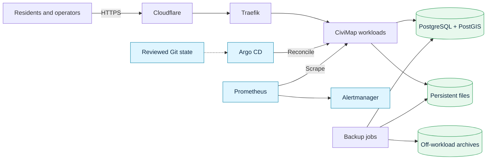
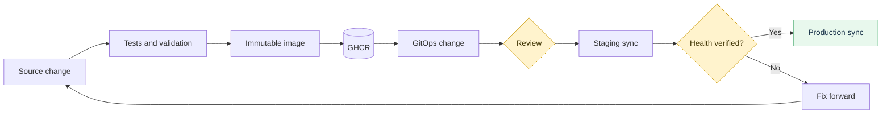

<p align="center">
  <picture>
    <source media="(prefers-color-scheme: dark)" srcset="docs/assets/civimap-lockup-readme-dark.svg">
    
  </picture>
</p>

<h1 align="center">Platform engineering</h1>

<p align="center">
  How CiviMap is built, deployed, monitored, and recovered on K3s.
</p>

<p align="center">
  <a href="https://civimap.net"><strong>Product website</strong></a>
  ·
  <a href="docs/architecture.md"><strong>Architecture and decisions</strong></a>
  ·
  <a href="#release-flow"><strong>Release flow</strong></a>
</p>

---

## At a glance

| Concern | Approach |
| --- | --- |
| **Runtime** | Containerized application workloads on a lightweight K3s cluster |
| **Delivery** | GitHub Actions builds immutable images; Argo CD deploys from reviewed Git state |
| **Configuration** | Helm packages Kubernetes resources and separates environment values |
| **Provisioning** | Ansible makes host preparation and K3s installation repeatable |
| **Observability** | Prometheus collects health signals; Alertmanager routes actionable alerts |
| **Recovery** | Scheduled database and file backups are accepted only after isolated restore checks |
| **Edge** | Cloudflare fronts the public application; Traefik routes traffic inside the cluster |

The central design rule is simple: **application pipelines produce artifacts;
Git and Argo CD control what runs in each environment.** Application CI never
needs cluster credentials.

## Current platform



The application, observability stack, and backup automation have separate
lifecycles and failure modes. Persistent data remains independent of workload
replacement. The current single-node design deliberately trades host-level
high availability for lower operational overhead, making external checks,
off-workload backups, and recovery rehearsals essential.

[Explore the runtime, delivery model, trade-offs, and future platform direction →](docs/architecture.md)

## What I built

- repeatable host and K3s provisioning with Ansible;
- repository-specific validation and container builds in GitHub Actions;
- commit-addressed images published to GHCR;
- environment-aware Kubernetes packaging with Helm;
- reviewed staging and production reconciliation through Argo CD;
- application and platform monitoring with Prometheus and Alertmanager;
- scheduled database and persistent-file backups;
- isolated restore verification before a backup is treated as usable.

## Release flow



Images are built once. Staging and production promote the same immutable
references, so a release changes declared state rather than rebuilding code.
Production synchronization remains reviewed while the platform is being
stabilized.

## Reliability and security choices

| Decision | Why it matters |
| --- | --- |
| **Pull-based deployment** | Production access stays out of application repositories and drift remains visible. |
| **Immutable promotion** | The artifact tested in staging is the artifact promoted to production. |
| **Private observability** | Administrative monitoring surfaces are not exposed publicly. |
| **Restore verification** | A written archive is not confused with a usable backup. |
| **Recovery separate from rollback** | Reverting application code does not silently replace production data. |
| **Backward-compatible migrations** | Forward fixes are safer than automatically restoring older data. |

## Current versus planned

This repository distinguishes deployed capabilities from future architecture.
The current platform is the K3s, Helm, Argo CD, Prometheus, Alertmanager, and
backup system described above.

Planned work includes Redis-backed caching and shared state, durable background
processing, selectively composed Terraform modules, software-supply-chain
controls, policy as code, progressive delivery, and service-level objectives.
These are documented as design direction—not presented as already deployed.

[Read the scaling path and adoption order →](docs/architecture.md#future-platform-direction)

## Technology

`GitHub Actions` · `Docker` · `GHCR` · `Ansible` · `K3s` · `Kubernetes` ·
`Helm` · `Argo CD` · `Prometheus` · `Alertmanager` · `Cloudflare` ·
`PostgreSQL` · `PostGIS` · `Bash` · `PowerShell`

## Repository guide

```text
.
├── README.md                 Portfolio overview and current platform
└── docs/
    ├── architecture.md       Detailed diagrams, decisions, and roadmap
    └── assets/               Repository artwork
```

## About CiviMap

[CiviMap](https://civimap.net) helps residents report local problems and gives
public authorities a structured way to triage, track, and resolve them. This
repository focuses on the platform-engineering decisions behind operating and
delivering that product without exposing private source code, credentials,
infrastructure addresses, or user data.
