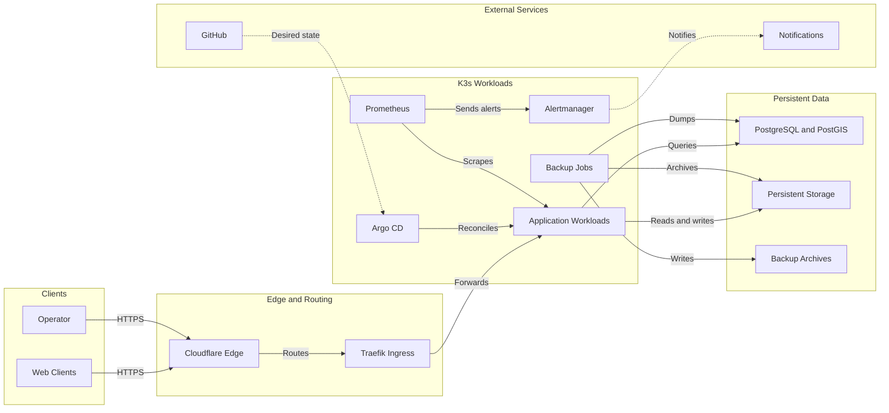
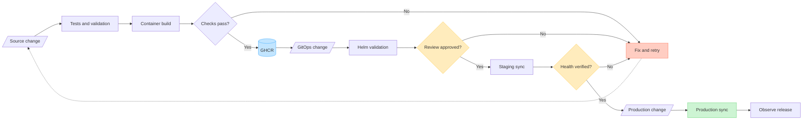
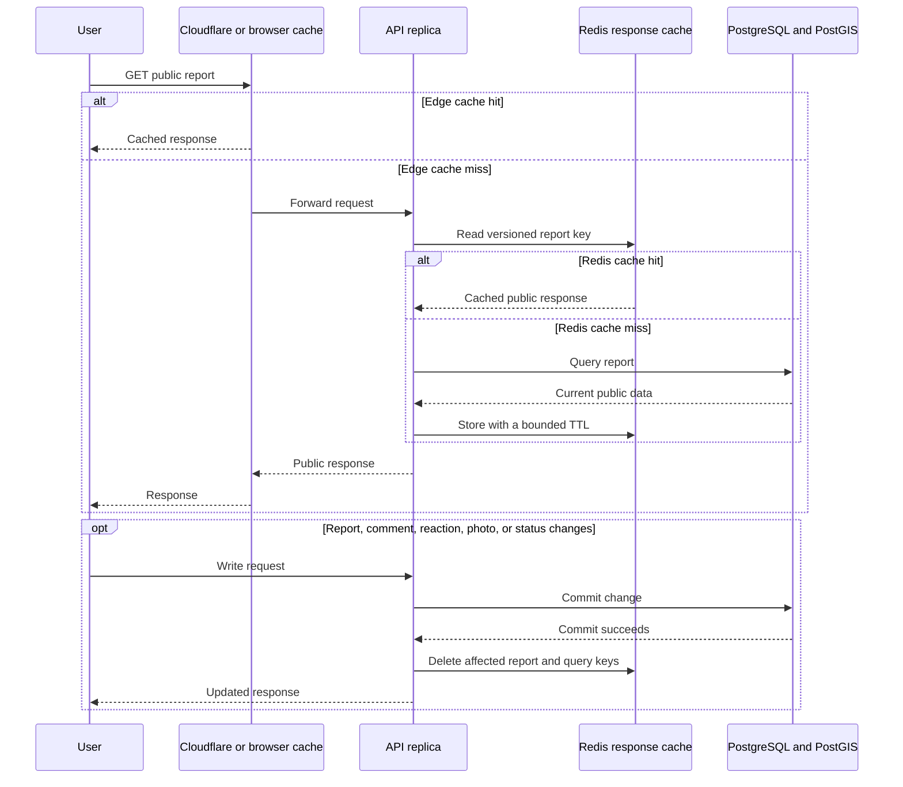
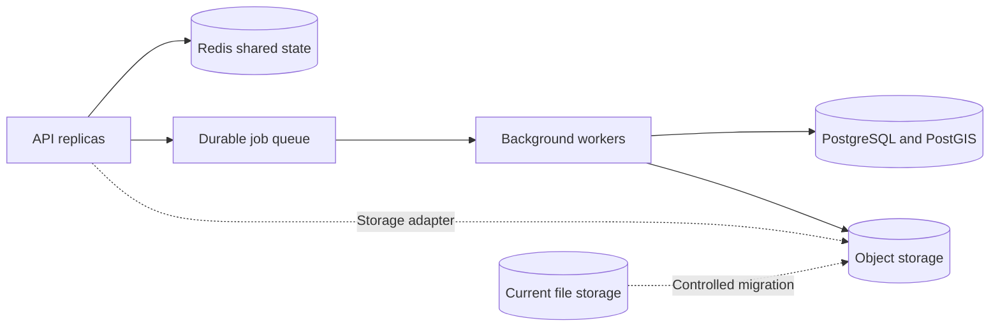
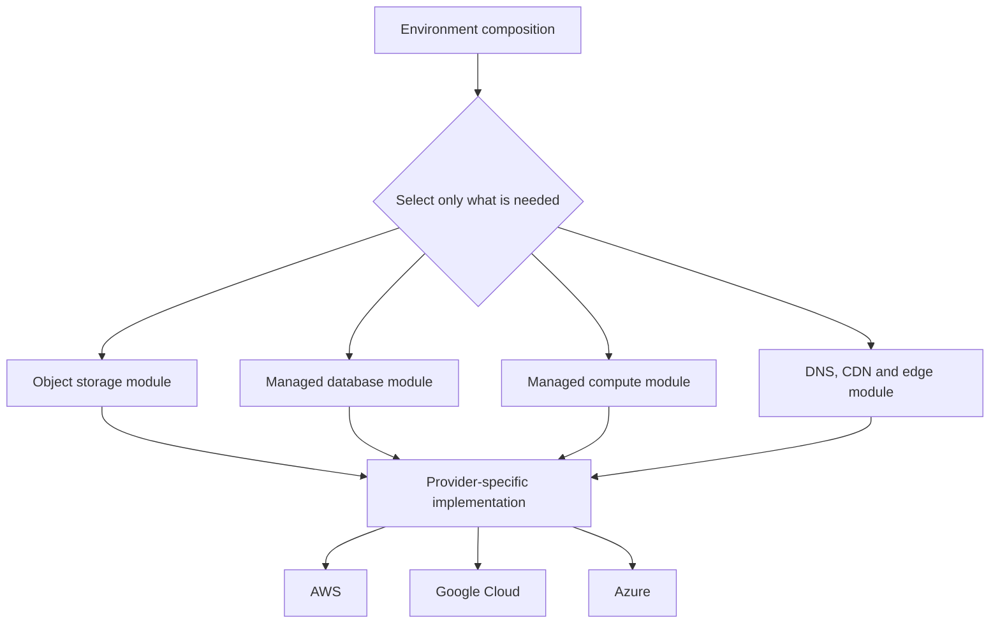

# Platform architecture

## Runtime

Traffic enters through the edge and ingress layers before reaching the K3s
workloads. Argo CD reconciles the workloads from Git, while monitoring and
backup automation operate independently from the request path.

### Why the runtime is arranged this way

Cloudflare handles the public edge while Traefik owns routing inside the
cluster. This keeps the host from being the public entry point and avoids
mixing external connectivity with Kubernetes service routing.

The application, monitoring, and backup jobs run as separate workloads because
they have different failure modes and lifecycles. An application deployment
should not replace the monitoring configuration or backup schedule. PostgreSQL,
uploaded files, and backup archives are shown separately for the same reason:
persistent data must survive workload replacement.

K3s provides the deployment, readiness, namespace, and rollback behaviour
needed for this environment without the cost and operational footprint of a
managed Kubernetes platform. The trade-off is that a single-node cluster does
not provide host-level high availability, so backups, restore testing, and
external availability checks remain important.

## Delivery

The application and GitOps pipelines are separate. Images are built once and
the same references are promoted through staging and production.

### Why delivery is separated from deployment

Application repositories are responsible for testing code and producing
versioned images. They do not hold cluster access. The GitOps repository records
which image version belongs in each environment, and Argo CD applies that state
from inside the cluster. This creates a small trust boundary and makes every
release or rollback visible as a Git change.

Staging and production use separate releases and persistent state, even when
they share the same host. This prevents a staging migration or resource change
from accidentally selecting production objects. Production remains a reviewed
sync while the platform is being stabilised: the explicit gate provides time to
inspect the rendered change, confirm staging health, and check recovery readiness
before promotion.

## Design decisions

### Ansible for host provisioning

Host setup must be repeatable from a fresh server rather than depend on an
operator remembering a sequence of commands. Ansible owns operating-system
prerequisites and K3s installation, while application releases remain in
GitOps. Keeping those responsibilities separate allows the host to be rebuilt
without coupling infrastructure changes to every application release.

### Pull-based GitOps

Application workflows publish images but cannot deploy to the cluster. Argo CD
pulls the desired state from Git, which keeps production access out of the
application repositories and leaves a reviewable deployment history. It also
detects drift when the live cluster no longer matches the committed state.

### Immutable promotion

Container tags are derived from commits. Staging and production use the same
artifact, so promotion changes configuration rather than rebuilding the image.
This removes uncertainty about whether production contains the code that was
actually tested and gives rollback a precise image reference.

### Helm and Argo CD

Helm renders and packages the Kubernetes resources. Argo CD compares the
rendered state with the cluster and performs reconciliation after review. Helm
solves reusable configuration; Argo CD solves deployment control and drift.
Using both avoids putting environment-specific copies of every manifest in Git
without asking templating alone to act as a release controller.

### Private observability

Prometheus, Alertmanager, and their exporters remain cluster-internal. They can
observe Kubernetes resources, application health, storage pressure, and backup
freshness without publishing administrative dashboards to the internet. Alert
delivery is rehearsed separately so a configured rule is not mistaken for a
working notification path. Because this stack shares the host it monitors, an
external uptime check is still needed to detect complete host failure.

### Recovery is not rollback

Backups cover the database and persistent files. Restore checks run separately
from the live database, and application rollback does not automatically imply a
database rollback. A completed archive only proves that a job wrote a file; an
isolated restore proves that the data can be used. Database migrations therefore
remain backward-compatible where practical, with forward fixes preferred over
automatically restoring older production data.

## Future platform direction

The following work is planned rather than implemented. It extends the current
platform only when traffic, storage growth, or security requirements justify
the additional operational cost.

### Application scaling path

#### Repeated public reads

Only public, permission-independent `GET` responses enter the shared cache.
Private, authority, admin, and user-specific representations bypass it unless
their cache keys include the complete authorization scope. A cache miss uses
PostgreSQL as the source of truth, then stores the public representation with a
TTL. Successful writes invalidate the individual report plus any affected list,
map, or statistics keys.

#### Shared state and background work

The shared-state role covers distributed rate-limit counters and cross-replica
real-time events. The durable queue covers retryable work such as image
processing, malware scanning, and notification delivery. Cache entries may be
evicted, while queued work must not disappear, so the response cache and durable
queue need separate memory, persistence, and eviction policies even if both use
Redis technology initially.

### Selective cloud provisioning

The first diagram shows the application scaling path. The second shows the
provisioning decision without implying that every deployment creates every
resource. A composition selects one or more capabilities and one target
provider; only the selected modules and their prerequisites enter that plan.

### Redis and background processing

Redis is planned as a shared cache for frequently requested public reports,
map/list queries, reference data, and expensive aggregates. The API will use a
cache-aside flow: read Redis first, fall back to PostgreSQL on a miss, populate
the cache with a bounded TTL, and invalidate affected keys only after a database
write commits successfully. A short single-flight lock will prevent many API
replicas from rebuilding the same popular key at once.

Redis is also planned as shared infrastructure for rate-limit counters and
cross-replica event delivery. Long-running work such as image processing,
malware scanning, and notification fan-out will move behind a durable queue.
The API can then acknowledge accepted work quickly while idempotent workers
retry failures without holding an HTTP connection open.

Redis Pub/Sub is suitable for transient real-time events but does not provide a
durable job history. The worker design will therefore use Redis Streams, a
Redis-backed task framework, or another broker according to the delivery and
replay guarantees required at implementation time. This choice remains open so
durability and replay requirements remain explicit.

### Composable Terraform provisioning

Terraform will complement Ansible rather than replace it. Ansible will continue
to configure self-managed hosts, while Terraform will manage provider APIs such
as identity, networking, DNS, object storage, managed databases, and managed
compute.

The Terraform design will use small reusable modules with explicit inputs and
outputs, then compose them for AWS, Google Cloud, or Azure. Each environment can
select only the capability it needs. For example, an object-storage composition
can create the bucket, encryption, access policy, lifecycle rules, and the
application credential without also creating a Kubernetes cluster, database,
or full copy of the application.

Separate state and plans for independently managed components reduce the blast
radius of a change. Provider-specific resources stay behind a common platform
contract, while the application uses storage and database adapters rather than
depending directly on one cloud vendor. The design targets a consistent
platform contract while still allowing provider-specific implementations.

### Security automation

The delivery pipeline will grow into a layered software-supply-chain check:

- dependency auditing for the backend and frontend;
- static analysis and secret detection on pull requests;
- Terraform, Kubernetes, and container configuration scanning;
- container image vulnerability scanning and software bills of materials;
- signed images and build provenance before promotion;
- dynamic security checks against staging where they can run safely;
- automated dependency-update or remediation pull requests.

Automatic fixing will remain review-gated. Tools can prepare a version bump or
configuration patch and run the full test suite, but they will not silently
change production. Critical findings block promotion; accepted exceptions need
an owner, justification, and expiry date. This preserves auditability while
still removing repetitive remediation work.

### Further platform work

These are later experiments to consider after the core scaling and Terraform
work is stable.

| Area | Planned experiment | Reason |
| --- | --- | --- |
| Policy as code | Introduce Kubernetes admission policies in audit mode, then enforce requirements for resource limits, non-root workloads, approved registries, and verified images. | Turns platform standards into tested controls instead of relying on review alone. |
| Progressive delivery | Add blue-green or canary releases with metric-based analysis and automatic rollback. | Limits release blast radius once the application runs multiple replicas and the health signals are trustworthy. |
| Service-level objectives | Add OpenTelemetry traces and define latency, availability, and background-job SLOs with error-budget alerts. | Connects logs, metrics, and requests while making reliability targets measurable. |
| Runtime detection | Evaluate rule-based container and host monitoring with rehearsed security alerts. | CI scanning cannot detect suspicious behaviour that begins only after a workload starts. |
| Recovery portability | Rebuild a disposable cluster and restore Kubernetes resources, database data, and object storage from an off-host backup. | Proves that recovery works without depending on the original node or cloud provider. |
| Cost visibility | Allocate Kubernetes and cloud cost by environment and component, then add budget alerts. | Makes selective cloud adoption measurable and exposes idle or oversized resources. |
| Preview environments | Generate short-lived, isolated environments for selected pull requests and remove them automatically when the review closes. | Gives infrastructure and application changes realistic acceptance testing without a permanent environment. |

### Adoption order

1. Add continuous dependency, secret, source, infrastructure, and image scans.
2. Introduce Redis for shared limits and real-time events before adding API
   replicas.
3. Add a durable worker queue for processing and malware-scanning jobs.
4. Build the Terraform module contract and one selectively deployable storage
   composition.
5. Implement equivalent compositions for the other providers and verify them
   with plan, policy, and integration tests.
6. Add managed database, compute, and edge modules only when a deployment needs
   those capabilities.
7. Add policy enforcement, service-level objectives, progressive delivery, and
   runtime detection after the multi-replica platform is stable.
8. Rehearse provider-independent recovery and introduce cost controls before
   expanding the cloud footprint.
